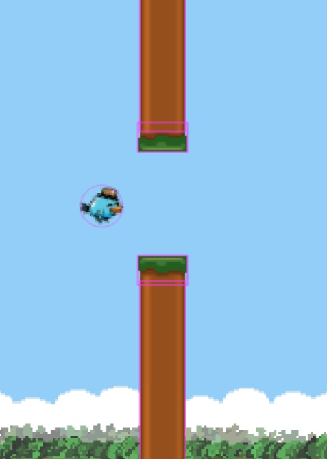
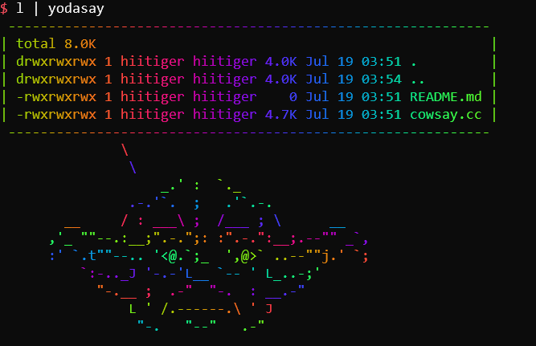
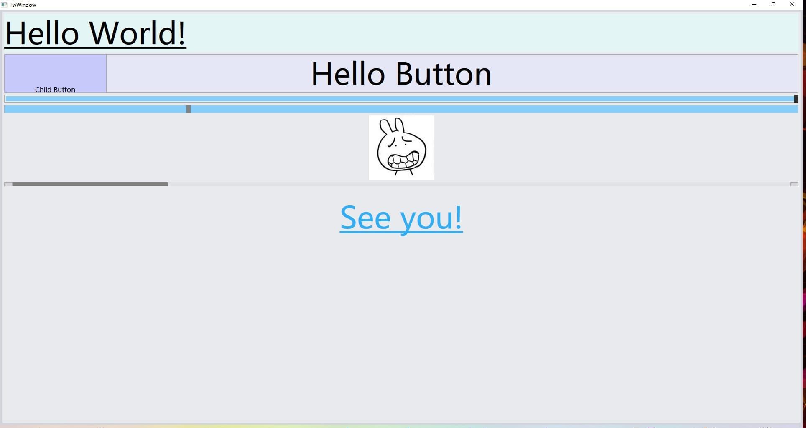
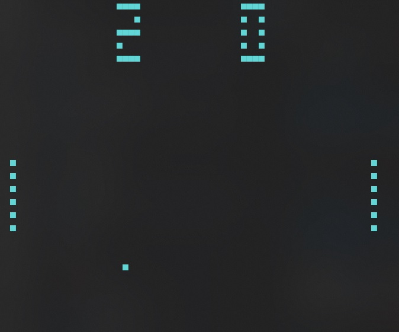

# build-your-own-x-d

Implementation of [build-your-own-x](https://github.com/danistefanovic/build-your-own-x), learn from great tutorials.

### 3d Renderer

#### [mini software renderer](https://github.com/hiitiger/build-your-own-x-d/tree/master/3drenderer)

A simple software renderer written in TypeScript

### Games and stuff

#### [TS WebGL engine](https://github.com/hiitiger/build-your-own-x-d/blob/master/game/ts-webgl-engine)

Implementation of Travis Vroman's [TypeScript Engine](https://www.youtube.com/watch?v=Hi3vyJQbULk&list=PLv8Ddw9K0JPiTHLMQw31Yh4qyTAcHRnJx), with some tweaking for debug.

### Compiler

#### [Building a Compiler](https://github.com/hiitiger/build-your-own-x-d/tree/master/compiler)

Implementation of Immo Landwerth's [Building a Compiler](https://www.youtube.com/channel/UCaFP8iQMTuPXinXBMEXsSuw).

### Command line tools

#### [yodasay](https://github.com/hiitiger/build-your-own-x-d/blob/master/command-line/cowsay.cc)

A colorful `cowsay` command line.

### GUI framework

#### [Twvx](https://github.com/hiitiger/twvx)

A direct UI library that demostrates how common GUI framework works, including GUI control tree, GUI controls, event dispatch, drawing, reflection and stuffs, implemetation in C++, works on Windows platform.

### Emulator

#### [CHIP-8](./emulator/chip8sharp)

