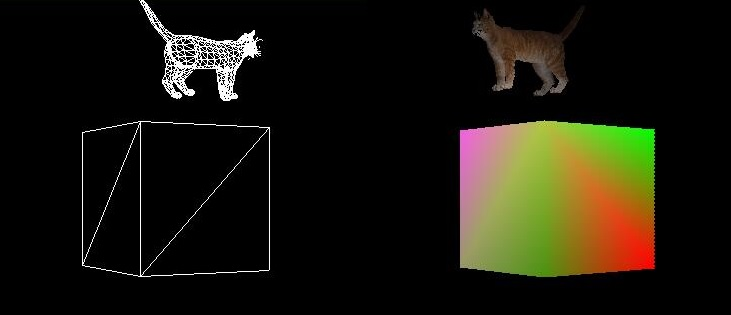
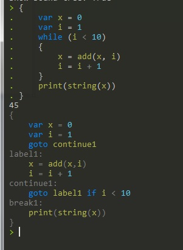

# build-your-own-x-d

Some implemetation of build-your-own-x, learn from great tutorials.

### 3d Renderer

#### [typescript software renderer](https://github.com/hiitiger/build-your-own-x-d/tree/master/3drenderer)

### Compiler

#### [Building a Compiler](https://github.com/hiitiger/build-your-own-x-d/tree/master/compiler)

Implementation of [Immo Landwerth's Building a Compiler](https://www.youtube.com/channel/UCaFP8iQMTuPXinXBMEXsSuw)

### Command line tools

#### [cowsay](https://github.com/hiitiger/build-your-own-x-d/blob/master/command-line/cowsay.cc)
