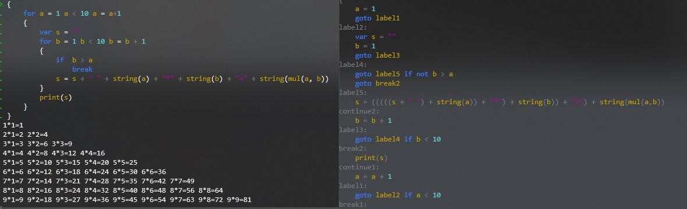

# build-your-own-x-d

Some implementation of build-your-own-x, learn from great tutorials.

### 3d Renderer

#### [mini software renderer](https://github.com/hiitiger/build-your-own-x-d/tree/master/3drenderer)

A mini software renderer written in TypeScript

### Compiler

#### [Building a Compiler](https://github.com/hiitiger/build-your-own-x-d/tree/master/compiler)

Implementation of Immo Landwerth's [Building a Compiler](https://www.youtube.com/channel/UCaFP8iQMTuPXinXBMEXsSuw).

### Command line tools

#### [yodasay](https://github.com/hiitiger/build-your-own-x-d/blob/master/command-line/cowsay.cc)

A colorful `cowsay` command line.

